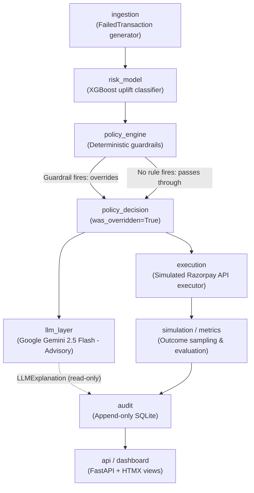

# Project Meridian — Architecture

> **Bounded AI agent for failed-payment revenue recovery.**  
> Razorpay AI Buildathon 2025, Track 3.

---

## Core Design Principle

> **The LLM never touches money or state — it only touches language.**

Every path through the system is architected so that an LLM failure, latency spike, hallucination, or adversarial output cannot mutate state or trigger transaction execution. All action decisions and execution flows pass through deterministic guardrails first.

This invariant is **enforced in code**:
- In `simulation/runner.py:run_single()`, `llm_layer/client.py` generates an `LLMExplanation` object that is passed *only* to `audit/logger.py` and displayed on `dashboard/`.
- `execution/executor.py:execute()` takes only `(transaction, policy_decision)` as parameters. It does **not** accept or inspect the `LLMExplanation` object.
- The outcome model `simulation/outcome_model.py:simulate_recovery_outcome()` operates strictly on `(transaction, policy_decision.final_action)`.

---

## System Pipeline Diagram



---

## Stage-by-Stage Architecture

### 1. `ingestion/` — Synthetic Transaction Ingestion
**File:** [`ingestion/generator.py`](ingestion/generator.py) (see also [`schemas/transaction.py`](schemas/transaction.py))  
Generates realistic, synthetic failed payment transactions (`FailedTransaction`) with parameterized noise and realistic distributions across failure codes (soft declines, hard stops, technical errors), amounts, payment methods, time of day, and retry histories. Follows synthetic data provenance documented in [`docs/data_provenance.md`](docs/data_provenance.md).

### 2. `risk_model/` -- Feature Extraction & Multi-Action Recovery Recommendation Model
**Files:** [`risk_model/features.py`](risk_model/features.py), [`risk_model/model.py`](risk_model/model.py), [`risk_model/recovery_rates.py`](risk_model/recovery_rates.py)  
Extracts 8 deterministic features from incoming transactions and scores 4 candidate recovery
actions using an XGBoost classifier (see ADR 0004). The model selects the highest-P(recover)
action -- this is a multi-action recommendation model, not a causal uplift estimator.
Generates local SHAP feature contributions (`shap_explainer.py`) explaining the statistical
drivers behind the recommended action. Model is persisted in XGBoost native JSON format.

### 3. `policy_engine/` — Deterministic Policy Guardrails (Final Authority)
**Files:** [`policy_engine/engine.py`](policy_engine/engine.py), [`policy_engine/rules.py`](policy_engine/rules.py)  
Evaluates mandatory regulatory and operational rules in strict priority order (hard-stop fraud codes under RBI FRM guidelines, card expiration, rate limits, 24h contact limits under DPDP, TRAI DND contact windows, cooldown timers). The policy engine possesses absolute veto power over the ML model recommendation.

### 4. `llm_layer/` — Schema-Constrained Advisory Explanations
**Files:** [`llm_layer/client.py`](llm_layer/client.py), [`llm_layer/fallback.py`](llm_layer/fallback.py), [`llm_layer/prompts.py`](llm_layer/prompts.py)  
Calls Google Gemini 2.5 Flash via the `google-genai` SDK using native JSON schema enforcement (`response_schema=LLMExplanation`), `thinking_budget=0`, and disabled automatic function calling (AFC) for low-latency (~2.6s) advisory explanations. If the API is unreachable, times out, or fails schema validation, the system falls back instantly to deterministic templates (`fallback.py`). The pipeline never blocks on the LLM.

### 5. `execution/` — Simulated Gateway Executor
**File:** [`execution/executor.py`](execution/executor.py)  
Dispatches the finalized `policy_decision.final_action` to simulated Razorpay API endpoints (`retry_now`, `retry_delayed`, `nudge_alt_method`, `escalate_to_human`, `stop`). Generates structured API call intents and tracks execution timestamps without moving real funds.

### 6. `simulation/` & `simulation/metrics.py` — Outcome Modeling & Evaluation
**Files:** [`simulation/outcome_model.py`](simulation/outcome_model.py), [`simulation/baselines.py`](simulation/baselines.py), [`simulation/metrics.py`](simulation/metrics.py), [`simulation/runner.py`](simulation/runner.py)  
Evaluates payment recovery outcomes using Bernoulli trials parameterized by context-adjusted recovery probabilities. Computes comparative recovery revenue, uplift against single-attempt and realistic multi-retry baselines, stopping-rule violations, and audit health metrics.

### 7. `audit/` — Append-Only Immutable Audit Log
**File:** [`audit/logger.py`](audit/logger.py) (see also [`schemas/audit.py`](schemas/audit.py))  
Persists the complete lifecycle of every transaction (`FailedTransaction`, `ModelDecision`, `PolicyDecision`, `LLMExplanation`, `ExecutionResult`, `SimulationOutcome`) into an append-only SQLite database. Enforces parameterized queries and monotonic sequential IDs to guarantee auditable non-repudiation.

### 8. `api/` & `dashboard/` — Server-Rendered Analytics Dashboard
**Files:** [`api/main.py`](api/main.py), [`api/routers/`](api/routers/), [`dashboard/templates/`](dashboard/templates/)  
Provides FastAPI REST endpoints (`/api/batch/metrics`, `/api/simulate/single`) and server-rendered HTMX dashboard views (`/`, `/transactions`, `/transactions/{id}`) visualizing real-time recovery metrics, dual baseline uplifts, SHAP feature importance, and live LLM explanations.

---

## Core Invariant Verification

```
simulation/runner.py:run_single()
  │
  ├── 1. model.predict(txn)            → ModelDecision
  ├── 2. engine.evaluate(txn, md)      → PolicyDecision [AUTHORITATIVE ACTION]
  │
  ├── 3. explainer.explain(pd, ...)    → LLMExplanation [ADVISORY ONLY]
  │         └─► written ONLY to audit/logger.py & displayed on dashboard
  │
  ├── 4. executor.execute(txn, pd)     ← takes (txn, pd); NEVER receives LLMExplanation
  ├── 5. simulate_outcome(txn, action) ← takes pd.final_action; NEVER receives LLMExplanation
  └── 6. audit_logger.log(record)      ← stores immutable snapshot
```

**Audit Trail:**
1. Code inspection of [`execution/executor.py`](execution/executor.py#L45) confirms `execute(txn, policy_decision)` has no parameter or reference to `LLMExplanation`.
2. Code inspection of [`simulation/runner.py`](simulation/runner.py#L85-L115) confirms `explanation` is only assigned to `AuditRecord.explanation` for post-hoc inspection.
3. Code inspection of [`policy_engine/engine.py`](policy_engine/engine.py) confirms decisions are 100% deterministic code rules.

---

## Technology Stack

| Component | Choice | Rationale |
|-----------|--------|-----------|
| **LLM Explainer** | Google Gemini 2.5 Flash (`google-genai`) | Native schema constraints (`response_schema`), sub-3s latency, single-provider architecture |
| **Recommendation Model** | XGBoost + SHAP | Multi-action scoring (P(recover | features, action)), high interpretability, fast CPU inference |
| **Policy Engine** | Pure Python Rules | Deterministic regulatory compliance (RBI FRM, DPDP, TRAI DND), zero framework risk |
| **Audit Storage** | SQLite (Append-only) | Immutable structured audit log with parameterized queries |
| **API & UI** | FastAPI + Jinja2 + HTMX | Server-rendered, minimal client state, real-time live dashboard |
| **Data Engine** | NumPy + Pandas + PyArrow | Reproducible synthetic data generation with verified distributions |
