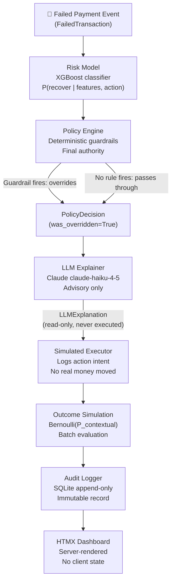

# Project Meridian — Architecture

> **Bounded AI agent for failed-payment revenue recovery.**  
> Razorpay AI Buildathon 2025, Track 3.

---

## Core Design Principle

> **The LLM never touches money or state — it only touches language.**

Every path through the system is designed so that a failure, hallucination, or
adversarial output from the LLM cannot mutate state or trigger execution. All
mutations flow through deterministic guardrails first.

This property is **verified by code** (see [Audit Trail](#audit-trail) below), not just claimed.

---

## System Overview



---

## Stage-by-Stage Pipeline

### Stage 1 — Transaction Ingestion

**File:** [`ingestion/generator.py`](ingestion/generator.py)

Synthetic `FailedTransaction` objects are generated from a seeded RNG. The
`FailedTransaction` schema ([`schemas/transaction.py`](schemas/transaction.py))
carries all contextual signal: `failure_code`, `amount_inr`, `retry_count_so_far`,
`time_of_failure`, `customer_contact_count_24h`, `is_subscription`, etc.

The synthetic data design is documented in [`docs/data_provenance.md`](docs/data_provenance.md).

### Stage 2 — Feature Extraction + Risk Model

**Files:** [`risk_model/features.py`](risk_model/features.py), [`risk_model/model.py`](risk_model/model.py)

8 numeric features are extracted deterministically from each transaction:

| Feature | Derivation | Predictive signal |
|---------|-----------|-------------------|
| `failure_code_category` | 0=hard_risk, 1=card_issue, 2=soft_decline, 3=system_error | Primary signal |
| `payment_method_risk` | Float per instrument [0.10, 0.35] | Instrument reliability |
| `retry_attempt_number` | retry_count_so_far + 1 | Chronicity |
| `amount_tier` | 5-bucket split at ₹500/2k/10k/50k | High-value is harder to recover |
| `is_outside_business_hours` | 1 if hour < 8 or hour ≥ 21 | Bank processing window |
| `contact_proximity_score` | Decay over 120 min since last contact | Recent contact signal |
| `is_subscription` | 0/1 | Subscription churn risk |
| `hour_of_day` | 0–23 | Time-of-day pattern |

An `XGBClassifier` scores all 4 candidate actions and returns the one with
highest `P(recover)`. SHAP values for the winning action are logged.

**Context-aware training labels (added 2026-08-31):** The model is trained on
labels drawn from `get_contextual_recovery_rate()` — which incorporates
`amount_inr`, `hour_of_day`, and `prior_failed_attempts_30d` as documented
modifiers — not just `(failure_code, action)`. This gives XGBoost genuine
signal across all 8 features. See [`risk_model/recovery_rates.py`](risk_model/recovery_rates.py)
for the modifier documentation and source citations.

### Stage 3 — Policy Engine (Guardrails)

**Files:** [`policy_engine/engine.py`](policy_engine/engine.py), [`policy_engine/rules.py`](policy_engine/rules.py)

The engine evaluates 6 rules in strict priority order. **First rule that fires wins.**

| Rule ID | Trigger | Override to | Regulation |
|---------|---------|-------------|------------|
| `HARD_STOP_001` | Failure code in `{FRAUD_FLAG, CARD_BLOCKED, STOLEN_CARD, KYC_HOLD}` | `ESCALATE_TO_HUMAN` | RBI FRM, DPDP |
| `HARD_STOP_002` | Failure code in `{CARD_EXPIRED, INVALID_CARD}` | `NUDGE_ALT_METHOD` | Merchant policy |
| `RATE_LIMIT_001` | retry_count_so_far ≥ 3 | `STOP` | RBI retry limits |
| `RATE_LIMIT_002` | customer_contact_count_24h ≥ 3 | `STOP` | TRAI DND |
| `COOLDOWN_001` | Last contact < 30 min ago and action requires contact | `RETRY_DELAYED` | Merchant policy |
| `WINDOW_001` | hour < 8 or hour ≥ 21 and action requires contact | `RETRY_DELAYED` | Merchant policy |

The engine's override rate (73.8% in baseline simulation) is high because
~30% of transactions have hard-stop codes and ~25% have hit retry or contact limits.
**Every override is deterministic and regulation-driven**, never probabilistic.

### Stage 4 — LLM Explainer

**Files:** [`llm_layer/client.py`](llm_layer/client.py), [`llm_layer/fallback.py`](llm_layer/fallback.py)

Claude claude-haiku-4-5 generates a human-readable explanation for the policy decision.
The explanation is **advisory only** — it is written to the audit log and shown in the
dashboard, but it is never read by the executor or metrics layer.

**Failure handling:** If the LLM call fails or returns an invalid schema, the system
falls back to a deterministic template (`fallback.py`). The `llm_fallback_to_template_count`
metric is reported honestly, even when non-zero.

**Why Anthropic-only (no fallback provider):** See [`docs/adr/0001-llm-has-no-execution-authority.md`](docs/adr/0001-llm-has-no-execution-authority.md).

### Stage 5 — Simulated Executor

**File:** [`execution/executor.py`](execution/executor.py)

Logs the action intent (API descriptor). No real API calls are made. No money moves.
This is the correct scope for a simulation: the executor is a record of what *would*
happen in production, not what actually happens.

### Stage 6 — Outcome Simulation

**File:** [`simulation/outcome_model.py`](simulation/outcome_model.py)

Samples a Bernoulli recovery outcome using `get_contextual_recovery_rate()` — the
context-adjusted probability from [`risk_model/recovery_rates.py`](risk_model/recovery_rates.py).
The same seeded RNG is used for each run, ensuring reproducibility.

### Stage 7 — Audit Logger

**File:** [`audit/logger.py`](audit/logger.py)

Append-only SQLite write. No UPDATE or DELETE is ever executed. Every transaction
is logged as a JSON blob with indexed fields for dashboard queries. The auto-increment
ID makes deletions detectable (gap in sequence).

SQL queries use parameterized statements only — no f-string interpolation into SQL
(Bandit B608 clean).

### Stage 8 — HTMX Dashboard

**Files:** [`api/`](api/), [`dashboard/`](dashboard/)

FastAPI serves Jinja2 templates with HTMX for partial updates. No client-side state.
Every number on the dashboard is computed from the audit DB at request time.

---

## Baseline Comparison Strategy

Two baselines are compared against the agent:

| Baseline | Description | Uplift label |
|---------|-------------|--------------|
| **Single-attempt** | Retry every transaction immediately, once | Secondary (disclosed) |
| **Realistic multi-retry** | 3 attempts: immediate, +24h, +72h — no guardrails | **Headline metric** |
| Never retry | Do nothing | Floor |

The "realistic multi-retry" baseline simulates what an unsophisticated merchant cron
job does. **The agent must beat this to claim genuine value.** See [`simulation/baselines.py`](simulation/baselines.py).

---

## Audit Trail

### "LLM never touches money" — verification path

```
simulation/runner.py:run_single()
  ├── model.predict(txn)          → ModelDecision (no side effects)
  ├── engine.evaluate(txn, md)    → PolicyDecision (deterministic, authoritative)
  ├── explainer.explain(pd, ...)  → LLMExplanation ──┐
  ├── executor.execute(txn, pd)   ← never reads LLMExplanation  ┘
  ├── simulate_outcome(txn, pd.final_action, rng)  ← never reads LLMExplanation
  └── AuditLogger.log(record)    ← LLMExplanation stored as text blob only
```

`explainer.explain()` is called after `policy_decision` is final. The `LLMExplanation`
object is used in exactly one downstream call: `AuditRecord(explanation=explanation)`.
`AuditRecord` is written to SQLite and returned to the API as JSON. It is never
passed to `executor.execute()` or `simulate_outcome()`.

### Stopping rules — verification path

`check_HARD_STOP_001` (`policy_engine/rules.py`) fires before any retry or nudge
action can be executed. The rule returns `ESCALATE_TO_HUMAN` unconditionally for
`{FRAUD_FLAG, CARD_BLOCKED, STOLEN_CARD, KYC_HOLD}`. The engine respects this
return value — `engine.evaluate()` returns the first rule result that is not `None`.

Test coverage: `tests/test_policy_engine.py` — 43 test cases, including:
- `test_hard_stop_001_*`: verifies each hard-stop code triggers escalation
- `test_rate_limit_001_*`: verifies retry count gate
- `test_override_preserves_model_recommendation`: verifies `was_overridden=True` is set

---

## Technology Choices

| Concern | Choice | Rationale |
|---------|--------|-----------|
| LLM | Claude claude-haiku-4-5 (Anthropic) | ADR 0001: one provider reduces failure surface |
| ML | XGBoost | Interpretable via SHAP; fast; no GPU required |
| Guardrails | Plain Python | ADR 0007: legible, auditable, no framework indirection |
| Dashboard | HTMX + FastAPI | ADR 0006: server-rendered, no client state to reason about |
| Audit log | SQLite | Appropriate for ≤100k records; append-only enforced by code |
| Data | Synthetic | ADR 0003: no public dataset has the right label structure |

See [`docs/adr/`](docs/adr/) for the full decision record.

---

## Reproducing the Simulation

```bash
# Install dependencies
pip install -e ".[dev]"

# Set API key
export ANTHROPIC_API_KEY="sk-ant-..."

# Run the simulation (5,000 transactions, seed=42)
python -m simulation.runner 5000 42

# Start the dashboard
uvicorn api.main:app --host 0.0.0.0 --port 8000

# Run tests
pytest tests/ -v --tb=short
```

The same seed always produces the same metrics. The README metrics table was generated
with `seed=42` and can be reproduced on any machine.
