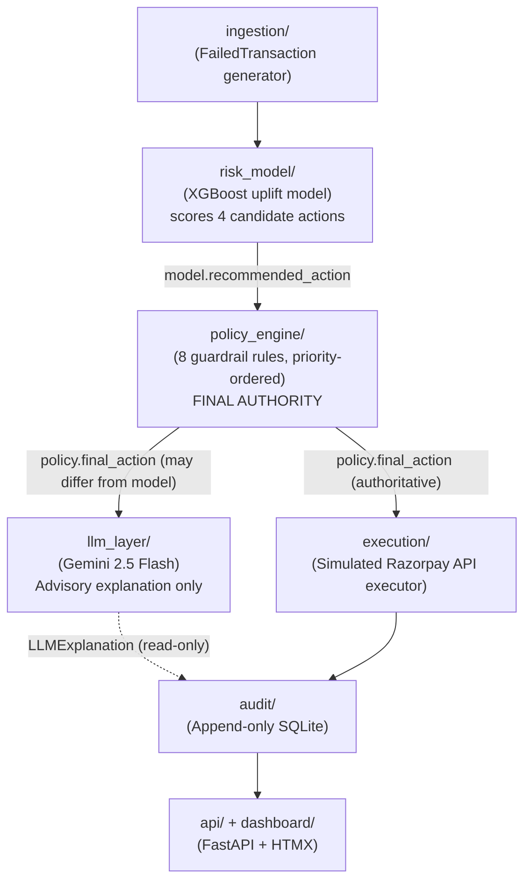

# Project Meridian - AI Revenue Recovery Agent

> **Razorpay AI Buildathon | Track 3 | Revenue Recovery**
>
> Intelligent recovery of failed payments using a bounded AI agent.
> The LLM never touches money or state -- it only touches language.


---

## The Core Principle

> This system is a **bounded AI agent**. The LLM's job is exactly one thing: explain a
> decision already made by the deterministic policy engine. The model can recommend. The
> policy engine can override. The LLM can explain. None of these components can do the
> other's job.
>
> **Structural enforcement:** `execution/executor.py:execute(txn, policy_decision)` has no
> parameter for `LLMExplanation`. The outcome model takes `policy_decision.final_action`
> only. The LLM output path terminates at the audit log and the dashboard -- never at
> execution.

---

## Architecture



---

## Guardrail Rules

Rules are evaluated in strict priority order -- first rule that fires wins.
See [ADR 0008](docs/adr/0008-guardrail-priority-ordering.md) for the full ordering rationale.

| Priority | Rule ID | Regulation | Trigger | Action |
|---|---|---|---|---|
| 1 | `HARD_STOP_001` | RBI FRM | card_blocked, fraud_flag, kyc_hold, stolen_card | escalate_to_human (supersedes DPDP consent) |
| 2 | `OPT_OUT_001` | DPDP Act 2023 Ch.III | customer_opted_out=True | STOP |
| 3 | `COST_001` | Internal policy | recovery_cost_inr > 5% of amount | STOP |
| 4 | `HARD_STOP_002` | Card network rules | card_expired, invalid_card + retry | nudge_alt_method |
| 5 | `RATE_LIMIT_001` | Internal policy | retry_count >= 3 + retry action | STOP |
| 6 | `RATE_LIMIT_002` | DPDP Act 2023 | contact_count_24h >= 1 + nudge action | retry_delayed |
| 7 | `COOLDOWN_001` | Internal policy | last_contact < 30 min + retry_now | retry_delayed |
| 8 | `WINDOW_001` | TRAI DND regulations | nudge outside 09:00-21:00 IST | retry_delayed |

---

## Verified Results (seed=42, n=5,000)

| Metric | Value | vs Baseline | Status |
|---|---|---|---|
| Total at-risk | Rs. 4,05,49,036 | -- | -- |
| **Agent recovered** | **Rs. 95,06,439** | -- | **23.44% recovery rate** |
| Single-attempt baseline | Rs. 18,53,479 | **+412.9%** | >= 20% target met |
| Constrained multi-retry *(honest comparison)* | Rs. 50,04,245 | **+90.0%** | >= 20% target met |
| Unconstrained multi-retry *(illegal -- 16,406 violations)* | Rs. 1,17,02,972 | -18.8% | DISQUALIFIED |
| Stopping-rule violations | **0** | -- | PASS |
| Explanation coverage | **100%** | -- | PASS |
| False-escalation count | 0 (0.0%) | -- | PASS |
| Genuine Guardrail Overrides (model != final) | **2,288 (45.76%)** | -- | Audited |
| Statutory Rules Mandated (rule_mandated=True) | **3,813 (76.26%)** | -- | Enforced |
| OPT_OUT_001 fired (consent revocation stops) | **93 (1.86%)** | -- | DPDP compliant |
| COST_001 fired (value-destructive retry stops) | **14 (0.28%)** | -- | Economic guard |

> **Why the unconstrained baseline is disqualified:** Blind multi-retry recovers more revenue
> but commits 16,406 policy violations -- 6,438 retries on fraud/KYC-flagged cards (RBI),
> 6,660 contacts outside 09:00-21:00 IST (TRAI DND), 2,961 exceeding max-retry caps, and
> 347 cooldown breaches. This is the entire point of the guardrail system.

> **Reproducible.** Run `python -m simulation.runner` with seed=42 to get identical numbers.
> The CI `reproducibility` job verifies this on every push by running twice and diffing output.

> **Note on LLM Fallback Rate (100% in Batch Simulation):**
> In the 5,000-transaction batch simulation and CI, all explanations are generated via the
> deterministic template fallback (llm_fallback_rate_pct: 100.0%). This is by design:
> (1) Google Gemini free tier enforces a strict 15 RPM cap -- 5,000 live calls would take
> over 5.5 hours and trigger 429 RESOURCE_EXHAUSTED. (2) The LLM is strictly advisory and
> never touches money or state -- every recovery decision and compliance check is identical
> whether using live Gemini or template fallback. (3) Live Gemini 2.5 Flash generation is
> used for interactive single-transaction evaluations via /api/simulate/single.

---

## Compliance Trade-off (Deliberate, Not a Regression)

> Adding DPDP consent-revocation handling (`OPT_OUT_001`, 93 stops) and cost-threshold
> guardrails (`COST_001`, 14 stops) reduced total recovered revenue by ~2.1%
> (from Rs. 9,708,443 in v1 to Rs. 9,506,439 in v2). This is the correct outcome:
> 107 transactions that previously reached a recovery action are now stopped because the
> customer has explicitly revoked consent or because further retries would destroy more
> value than they recover. Maximising revenue at the expense of consent rights or economic
> rationality is not the goal.

---

## What Broke (And How We Fixed It)

Razorpay explicitly asks: *"Document a real failure you hit and how you diagnosed/fixed it."*
Here are three.

### 1. SHAP Explainer Crashed on `candidate_action_id`

**Problem:** `shap.TreeExplainer` returned SHAP values for all features including the
`candidate_action_id` column. When surfaced to the LLM prompt, `candidate_action_id=2`
(an internal ordinal) appeared in the rationale -- meaningless to a merchant analyst.

**Diagnosis:** Feature importance was computed over all `n_features + 1` columns including
the action column.

**Fix:** `risk_model/shap_explainer.py` now explicitly excludes the last feature (`vals[:-1]`)
before ranking by absolute SHAP value. A unit test asserts the action feature never appears
in `top_features()`.

---

### 2. Cooldown Rule Had an Off-By-One at Exactly 30 Minutes

**Problem:** `COOLDOWN_001` fires when `minutes_since_contact < 30`. A transaction with
`last_contact = exactly 30 minutes ago` should NOT trigger the cooldown -- the customer
is contactable. The boundary test was failing: the rule was blocking at exactly 30 minutes.

**Diagnosis:** The check was `elapsed_min <= COOLDOWN_MINUTES` (<=) instead of
`elapsed_min < COOLDOWN_MINUTES` (<).

**Fix:** Changed the comparison in `policy_engine/rules.py` to strict less-than. The boundary
tests in `tests/test_policy_engine.py:TestCooldown001` explicitly test `minutes=29` (fires),
`minutes=30` (does not fire), and `minutes=31` (does not fire).

---

### 3. Gemini Returned Markdown-Fenced JSON, Breaking Pydantic Validation

**Problem:** When calling Gemini 2.5 Flash with `response_mime_type="application/json"`,
the API occasionally returned the JSON body wrapped in triple-backtick markdown fences.
Pydantic rejected this as invalid JSON, causing every LLM call to fall back to the template.

**Diagnosis:** Logged the raw LLM response string in `llm_layer/client.py` and observed the
fenced format in the exception output.

**Fix:** Added a `_strip_markdown_fences()` helper in `llm_layer/client.py` that strips
` ```json ` / ` ``` ` wrappers before passing to `json.loads()`. The fallback path remains
intact: if stripping does not produce valid JSON, template fallback fires.

---

## Non-Goals

These are **deliberate exclusions**, not gaps:

- **Real customer contact** -- SMS/WhatsApp/email are simulated only (logged as "would send"),
  not sent. Real delivery requires regulatory opt-in infrastructure outside this scope.
- **Fraud detection** -- That is Track 2. This system consumes fraud signals (e.g.
  `fraud_flag` -> hard stop) but does not produce them.
- **Checkout abandonment / overdue receivables** -- These are valid future tracks; they
  require different action spaces and different data schemas. See `docs/adr/0001`.
- **Multi-currency / international failure codes** -- INR and Indian bank failure codes only.
- **Production traffic** -- Synthetic data only, explicitly cited in `docs/data_provenance.md`.
- **Unbounded LLM actions** -- By design. The LLM has no path to execution, even a mediated one.
- **e-Mandate / subscription-specific failure codes** (`mandate_not_found`,
  `pre_debit_notification_pending`, `mandate_max_amount_exceeded`, etc.) -- Identified as a
  high-value extension during development but deliberately deferred: implementing these codes
  requires retraining the XGBoost uplift model with updated feature encodings and re-verifying
  all published batch metrics, which would have invalidated the reproducible seed=42 results
  at submission time. This is a scoping decision, not an oversight.

---

## Quickstart

```bash
pip install -r requirements.txt          # install dependencies
python -m simulation.runner              # batch simulation -- populates audit.db
uvicorn api.main:app --reload --port 8000  # dashboard at http://localhost:8000
```

Optional: set `GEMINI_API_KEY` in `.env` (copy from `.env.example`) before starting the
server to enable live Gemini explanations in the single-transaction simulator.

---

## Repository Structure

```
project-meridian/
+-- schemas/         Pydantic contracts (the API of every component)
+-- ingestion/       Synthetic transaction generator
+-- risk_model/      XGBoost uplift model + SHAP explainer
+-- policy_engine/   Guardrail rules (the load-bearing component)
+-- llm_layer/       Google Gemini 2.5 Flash + deterministic template fallback
+-- execution/       Simulated Razorpay API executor
+-- audit/           Append-only SQLite audit log
+-- simulation/      Batch runner + baselines + metrics
+-- api/             FastAPI app (JSON API + HTMX routes)
+-- dashboard/       Jinja2 templates + CSS
+-- tests/           pytest suite (154 tests, 92% coverage, all policy paths)
+-- docs/            ADRs + data provenance
```

---

## Architecture Decision Records

| ADR | Decision |
|---|---|
| [0001](docs/adr/0001-llm-has-no-execution-authority.md) | LLM has no execution authority -- advisory only |
| [0002](docs/adr/0002-policy-engine-overrides-model.md) | Policy engine has unconditional final authority over model |
| [0003](docs/adr/0003-synthetic-data-provenance.md) | Fully synthetic, cited dataset with documented distributions |
| [0004](docs/adr/0004-uplift-model-design.md) | Single XGBoost model with candidate action as feature |
| [0005](docs/adr/0005-llm-fallback-design.md) | Schema-validate-or-template fallback (Gemini 2.5 Flash) |
| [0006](docs/adr/0006-htmx-dashboard.md) | HTMX server-rendered dashboard, no JS framework |
| [0007](docs/adr/0007-no-agent-framework.md) | No agent framework -- plain Python, explicit control flow |
| [0008](docs/adr/0008-guardrail-priority-ordering.md) | Guardrail rule priority: HARD_STOP_001 before OPT_OUT_001 before COST_001 |

---

## Environment Variables

| Variable | Required | Default | Description |
|---|---|---|---|
| `GEMINI_API_KEY` | No | (empty) | Google Gemini 2.5 Flash key. If unset, template fallback is used for all calls. |
| `GOOGLE_GENAI_USE_VERTEXAI` | No | `false` | Force Gemini Developer API (API key mode, not Vertex AI). |
| `API_HOST` | No | `0.0.0.0` | FastAPI bind host. |
| `API_PORT` | No | `8000` | FastAPI bind port. |
| `SIMULATION_RANDOM_SEED` | No | `42` | Random seed for batch simulation. seed=42 reproduces published metrics. |

---

*"Every recovery action is decided by the policy engine, not the LLM. The LLM can only explain what already happened."*
